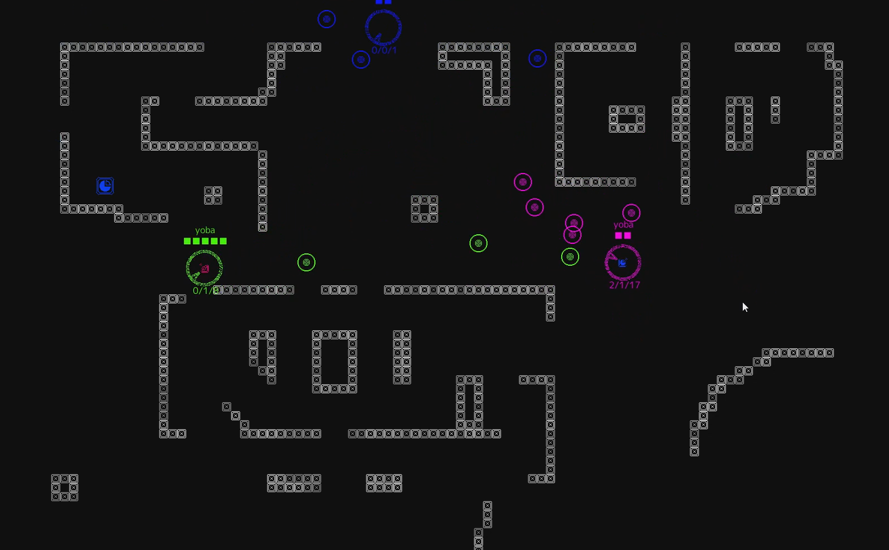

## goguming
Couch multiplayer with your mobile phone as controller



### Download
Get prebuilt version as zip archive from [latest release](https://github.com/Badrpas/goguming/releases/latest)

### How to
The game starts HTTP server on your PC on 8080 port (by default).

You need to open a page in your mobile browser by IP address of your PC.

To find out the IP (on windows)

- Open command line
- Type `ipconfig`
- Look for lines with `IPv4 Address`. Usually IP address will be in format `192.168.xxx.xxx`
- In your mobile browser go to that address with `8080` port. For example `192.168.1.23:8080`

### Build and run from source
#### Prerequisites
- [go](https://go.dev/dl/) version 1.17

- [Node.js](https://nodejs.org/) for frontend build

#### Get the sources
```shell
$ git clone https://github.com/Badrpas/goguming.git
$ cd goguming
```

#### Build
```shell
$ make
```
This builds web client and `game` executable 

#### Run
```shell
$ make run
```

#### Or both in one step
```shell
$ make build run
```

#### CLI options
Bind on a custom address

```shell
-addr 0.0.0.0:7331
```

Run a specific level
```shell
-level levels/mylevel.tmx
```

### Custom levels
You can use [Tiled](https://www.mapeditor.org/) to open `.tmx` files in `levels` dir to edit or create new levels

